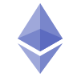

    
 

# Hello! 🚀

I'm a Flutter Developer currently employed by the international software consultancy firm MonstarLab, where I develop mobile applications for both Android & iOS using Flutter.
Outside of this, I have a healthy obsession with blockchain and Solidity development, where I would consider myself on an **intermediate** level.
I have an AP in Computer Science and a BA in Software Development from KEA (Copenhagen School of Design and Technology).

Blockchain has been a part of my life since 2012 when my friend mined his first bitcoins and have since then been under the blockchain spell✨

I am a firm believer in Polkadot & Kusama and their respective parachains, mostly **Astar**/**Shiden**, **Acala**/**Karura** & **Moonbeam**.
 
 

## About me
- 🔭 I’m currently attending Encode Academy, run by [Encode Club](https://www.encode.club/) in collaboration with [Extropy](https://extropy.io/) (check them out, they do some really cool stuff!)
- 🌱 I’m currently learning Intermediate-Advanced **Solidity**, **Web2** & **Web3**
- 👯 I’m looking to collaborate on any **interesting** projects, ideas for any chain with **EVM compatibility**
- 🤔 I’m looking for help with **advanced** Solidity concepts, **best practices** and general **architecture**
- 💬 Ask me about **Flutter**, **Ethereum**, **Polkadot**, **TradFi** vs. **DeFi**

 
 

## 🔨Languages, Tools & Tech 👷
Languages, tools and technologies I either use at work or enjoy using on my own time.

    
    
    
    
    
    
    
    
    

 
 
 

## Statistics

